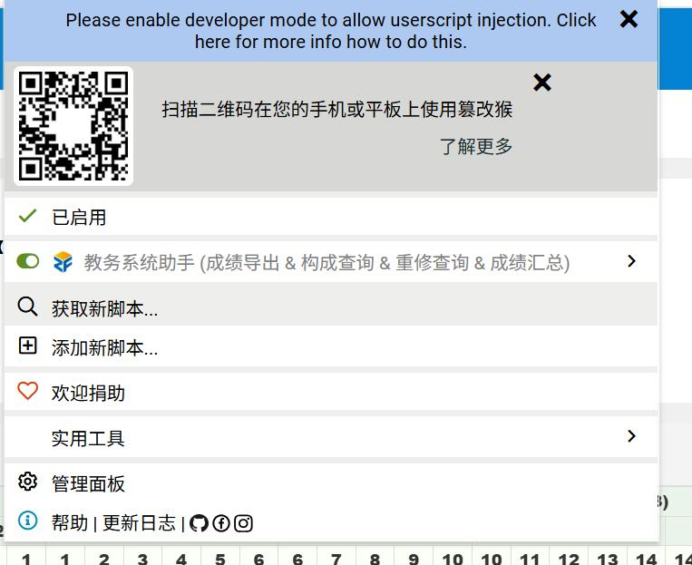
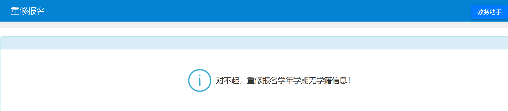
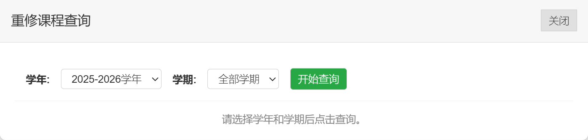
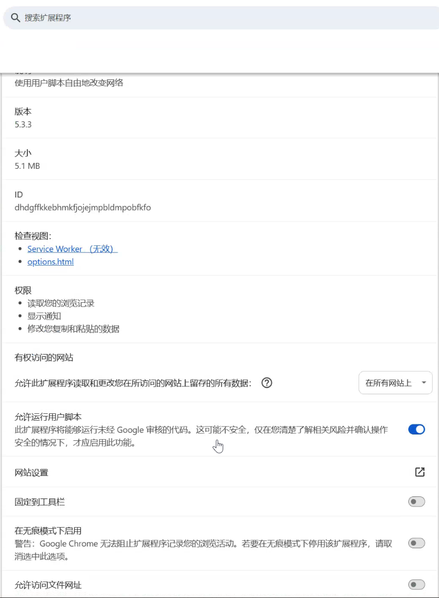
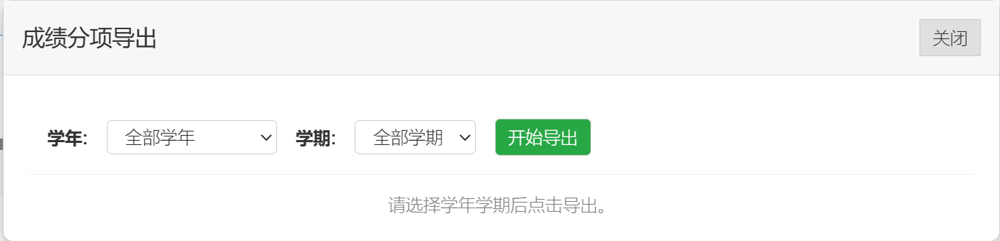

# nwu-jwgl-helper
## 简介
西北大学教务系统助手 - 油猴脚本
可以实现教务系统的增强功能
# 使用方法
直接登陆教务系统官网。

直接在主页即可查询成绩，导出成绩。

直接点击对应官网对应的页面，如查询重修就直接进入相关的页面。

右上角会有教务助手的按钮，点击按钮显示面板，根据需要选择学年学期。然后直接查询。

# 图片展示

# 已实现的功能
- 重修成绩查询
- 成绩分项查询（平时成绩）

# 特别鸣谢
成绩分项相关代码
https://github.com/mxwiser/fzjw