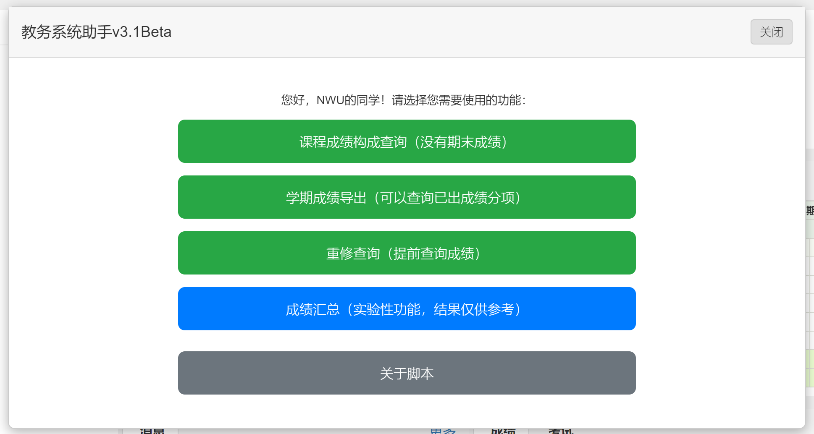
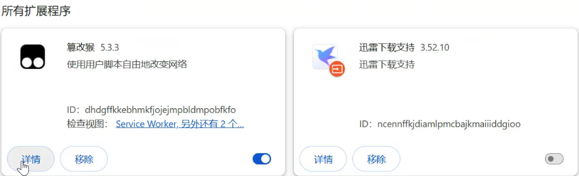

# nwu-jwgl-helper

[查看我的 GitHub 项目](https://github.com/wzp100/nwu-jwgl-helper)

[安装油猴脚本（原网站被墙）](https://greasyfork.org/zh-CN/scripts/540817-%E6%95%99%E5%8A%A1%E7%B3%BB%E7%BB%9F%E5%8A%A9%E6%89%8B-%E6%88%90%E7%BB%A9%E5%AF%BC%E5%87%BA-%E9%87%8D%E4%BF%AE%E6%9F%A5%E8%AF%A2)

[安装油猴脚本（镜像网站）](https://soujiaoben.org/#/s?id=540817&host=greasyfork)

# 简介

西北大学教务系统助手 - 油猴脚本

可以实现教务系统的增强功能

# 使用方法

直接登陆教务系统官网。

直接在主页即可查询成绩，导出成绩。

直接点击对应官网对应的页面，如查询重修就直接进入相关的页面。

右上角会有教务助手的按钮，点击按钮显示面板，根据需要选择学年学期。然后直接查询。

# 图片展示

# 已实现的功能

- 重修成绩查询
- 成绩分项导出（平时成绩）
- 课程成绩构成查询
- 成绩汇总（实验性功能）

# 常见问题

1. 安装后找不到按钮，脚本已经开启但是呈现灰色。

主要是由于浏览器没有开启开发人员模式。可按键盘F12开启。

2. chrome打开管理员后依然无法使用脚本

需要去扩展选项里面开启“允许运行用户脚本”的选项

# 规划

- [ ] 保存现有的成绩，自动比对突出显示新出的成绩
- [ ] 自定义导出的字段
- [ ] 网页解析excel的内容，直接在网页显示
- [ ] 汇总各科成绩，并在成绩放开前按比例核算未放开的成绩分项
- [ ] 按课程以卡片形式展示成绩，并支持导出为图片

# 特别鸣谢

成绩分项相关代码

https://github.com/mxwiser/fzjw
